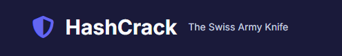

<p align="center">
  <!-- Replace with your logo file -->
  
</p>

<p align="center">
  <a href="https://go.dev/"></a>
  
  
  
</p>

HashCrack is a Go‑based, CPU hash‑cracking toolkit with a Web UI and a simple CLI. It ships Docker‑first with a single `docker compose up` to run the web, and you run the CLI inside the same container.

---

## Table of contents
- [Features](#features)
- [Supported algorithms](#supported-algorithms)
- [Quick start (docker compose)](#quick-start-docker-compose)
- [Using the CLI (inside the container)](#using-the-cli-inside-the-container)
- [Web UI](#web-ui)
- [Project layout](#project-layout)
- [API reference](#api-reference)
- [Build from source (optional)](#build-from-source-optional)
- [Troubleshooting](#troubleshooting)

---

## Features
- Fast, concurrent cracking (bounded worker pools)
- Three attack modes: dictionary, mask, and brute force
- Real‑time progress via SSE with speed, ETA, and totals
- Upload custom wordlists (validated) or use the built‑in sample
- Straightforward CLI for one‑off runs
- Algorithm detection heuristics (suggestions)
- Docker and Compose first‑class

## Supported algorithms


| Category | Algorithm | Notes |
|---|---|---|
| Core digests | md5 | Lower/upper hex compare supported |
|  | sha1 |  |
|  | sha256 / sha384 / sha512 |  |
|  | sha3‑224 / sha3‑256 / sha3‑384 / sha3‑512 |  |
|  | shake128 (256‑bit out) / shake256 (512‑bit out) |  |
| Other | ripemd160 |  |
| Windows/legacy | ntlm | UTF‑16LE + MD4 |
|  | lm | DES‑based legacy; uppercase hex |
| Infra | mysql (4.1+) | `*` + upper hex of SHA1(SHA1(pw)) |
|  | cisco7 | Reversible “type 7” (decode/compare) |
| LDAP | ldap_md5 | `{MD5}<base64>` |
|  | ldap_sha1 | `{SHA}<base64>` |
| KDFs | bcrypt | Parameters present; `^\$2[aby]\$\d{2}\$`|
|  | scrypt | `scrypt:<saltHex>:<keyHex>` |
|  | argon2id | `argon2id:<saltHex>:<keyHex>` |
|  | pbkdf2‑sha1 / ‑sha256 / ‑sha512 | `pbkdf2-<algo>:<saltHex>:<iter>:<keyHex>` |

<details>
<summary>Detection hints</summary>

- MySQL: `*` followed by 40 uppercase hex
- LDAP MD5/SHA1: `{MD5}` / `{SHA}` followed by base64
- Cisco7: two digits followed by hex pairs
</details>

---

## Quick start (docker compose)

> This repo includes `docker-compose.yml`. Compose builds the image, maps port 8080, and mounts the repo at `/data` inside the container.

```powershell
# From repository root (PowerShell)
# Build image and start the web UI in the background
docker compose up --build -d

# Tail logs (optional)
docker compose logs -f hashcrack

# Open the web UI
# http://localhost:8080
```

- Volume: the current repo is mounted at `/data` in the container.
- Uploads: saved under `uploads/` in your repo.
- Default port: `8080` (mapped to host `8080`).

To stop and clean up:
```powershell
docker compose down
```

---

## Using the CLI (inside the container)
Run the CLI with `docker compose exec` so paths like `uploads/...` match the mounted `/data`.

List supported algorithms:
```powershell
docker compose exec hashcrack hashcrack list
```

Dictionary example (MD5 of "hello"):
```powershell
# Wordlist includes "hello" at uploads/test-wordlist.txt
$hash = "5d41402abc4b2a76b9719d911017c592"
docker compose exec hashcrack hashcrack `
  crack -a md5 -h $hash -w uploads/test-wordlist.txt
```

Mask example (4 letters + 2 digits):
```powershell
docker compose exec hashcrack hashcrack `
  crack -a sha1 -h <sha1-hash> -m "?l?l?l?l?d?d"
```

Notes:
- The current CLI focuses on dictionary and mask. Brute‑force is available and best used via the Web UI.
- Global flags: `--workers`, `--timeout`, `--log`, `--verbose`. Wordlist rules: `--rules "+c,+d2"`.

---

## Web UI
1. Start: `docker compose up --build -d`
2. Open: http://localhost:8080
3. In the form:
   - Enter the target hash (algorithm suggestions appear)
   - Choose the algorithm explicitly
   - Select a mode: Dictionary, Mask, or Brute force
   - Optionally set transformation rules and worker count
   - Start and monitor progress, speed, ETA, and results
4. Upload wordlists (`.txt`/`.lst`, ≤10MB) or use the built‑in sample (`testdata/rockyou-mini.txt`).

If SSE disconnects, the UI falls back to polling and continues updating tasks and stats.

---

## Project layout
```
cmd/hashcrack/        # CLI entrypoint
internal/web/         # HTTP server, REST + SSE, task manager
internal/hashes/      # Hash/KDF registry + implementations
pkg/mask/             # Concurrent mask generator/runner
pkg/bruteforce/       # Concurrent brute forcer
web/static, template  # UI assets
uploads/              # Uploaded wordlists (mounted)
```

---

## API reference

| Method | Path | Description |
|---|---|---|
| GET | `/api/stats` | Runtime and aggregate task stats |
| GET | `/api/algorithms` | Supported algorithms |
| GET | `/api/detect?target=...` | Algorithm suggestions for a target |
| GET | `/api/tasks` | List tasks |
| POST | `/api/tasks` | Create a task |
| GET | `/api/tasks/{id}` | Get a task |
| POST | `/api/tasks/{id}/stop` | Stop a running task |
| DELETE | `/api/tasks/{id}` | Delete a task |
| POST | `/api/uploads` | Upload wordlist (`multipart/form-data`, field `file`) |
| GET | `/api/events` | SSE stream with `tasks` events |

<details>
<summary>Create task (JSON body)</summary>

```json
{
  "algo": "md5",
  "target": "5d41402abc4b2a76b9719d911017c592",
  "mode": "wordlist",            
  "use_default_wordlist": true,  
  "rules": ["+c", "+d2"],
  "mask": "?l?l?l?d?d",
  "salt": "",
  "workers": 4,
  "bf_min": 1,
  "bf_max": 6,
  "bf_chars": "abcdefghijklmnopqrstuvwxyz0123456789",
  "bcrypt_cost": 12,
  "scrypt_n": 32768, "scrypt_r": 8, "scrypt_p": 1,
  "argon_time": 1, "argon_mem_kb": 65536, "argon_par": 4
}
```
</details>

---

## Build from source (optional and not needed)
Requirements: Go 1.22+

```powershell
# Build CLI
go build -o bin/hashcrack ./cmd/hashcrack

# Run web locally
bin/hashcrack web --addr :8080
```

Environment overrides (via Viper): `HASHCRACK_WORKERS`, `HASHCRACK_LOG`, etc.

---

## Troubleshooting
- Default wordlist: the UI references `testdata/rockyou-mini.txt` included in this repository.
- Uploads: `.txt`/`.lst`, <=10MB. Binary content is rejected.
- Paths: inside the container the repo is `/data`; use relative paths like `uploads/...`.
- Compose lifecycle: `docker compose down` to stop; `docker compose logs -f` to follow logs.

---
> Use ethically and legally. Only attack hashes you own or are authorized to test.

Developped with love by Zeph as part of my internship at GI.

